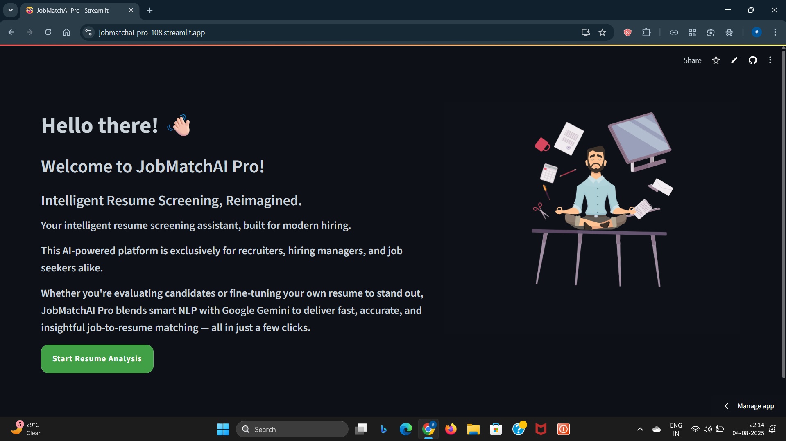
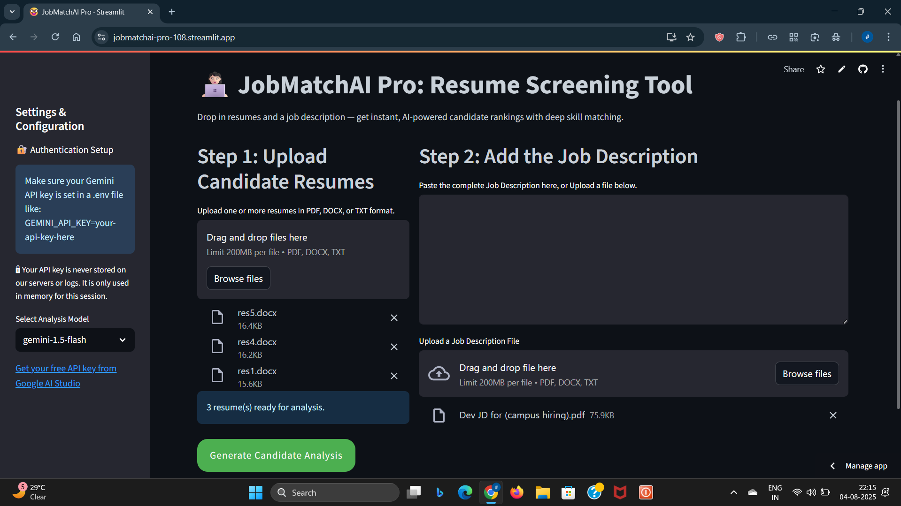
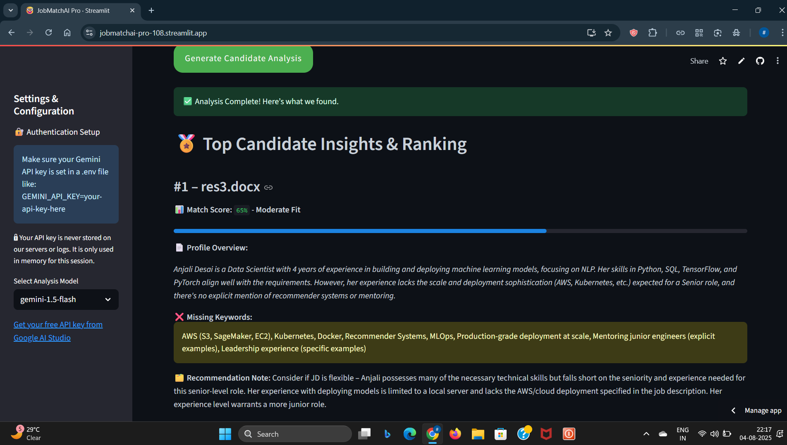
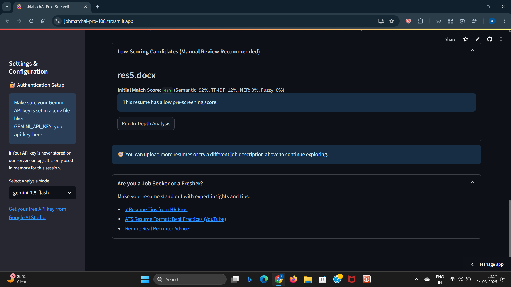

# 💼 JobMatchAI Pro — Intelligent Resume Screening & Job Matching

## 📌 Project Overview

JobMatchAI Pro screens resumes against job descriptions locally with a cutting-edge multi-component NLP pipeline before leveraging Google's Gemini API for "human-like" contextual analysis. It supports PDF, DOCX, and TXT files, and ensures high-performing, relevant scoring for diverse roles.

------------------------------------------------------------------------
## 🔗 Live Demo & Repository

- **🌐 Live App:** [JobMatchAI Pro on Streamlit](https://jobmatchai-pro-108.streamlit.app/)
- **📦 GitHub Repository:** [github.com/DK-SAI07/JobMatchAI-Pro](https://github.com/DK-SAI07/JobMatchAI-Pro)
  
------------------------------------------------------------------------

## ✨ Features

- Upload Resume & JD files (PDF, DOCX)
- Gemini LLM integration for candidate feedback
- spaCy skill NER + Sentence Transformers for semantic similarity
- Skill match visualization and word clouds
- Secure API key access via .env or Streamlit Secrets
- Simple and intuitive Streamlit UI

------------------------------------------------------------------------

## 🛠️ Tech Stack

-   Python 3.10+
-   Google Generative AI (Gemini 2.5 Pro / Flash via API key)
-   spaCy + SkillNer
-   Sentence-Transformers (semantic embeddings)
-   PDFPlumber, DOCX2TXT
-   TF-IDF vectorizer (scikit-learn)
-   RapidFuzz (fuzzy matching)
-   WordCloud
-   Streamlit + Streamlit-Lottie
-   Python Dotenv, Streamlit Secrets

------------------------------------------------------------------------

## 🗂️ Folder Structure

``` bash
JobMatchAI/
├── app.py                          # Main Streamlit App
├── .env                            # Environment file (API Key)
├── requirements.txt                # Python Dependencies
├── skill_db_relax_20.json          # Skill DB for NER
├── skill_synonyms.json             # Synonym mappings
├── token_dist.json                 # Optional token-level info
├── Animation-1752042367104.json    # Lottie Animation
├── assets/
│   └── styles.css                  # Custom CSS styles
│   └── screenshots/
│        ├── home_page.png
│        ├── upload_jd_resume.png
│        ├── analysis_results.png
│        └── low_scores_careertips.png
├── LICENSE.md
├── .gitignore
└── README.md
```

------------------------------------------------------------------------

## ⚙️ Installation

1. **Clone the repository**:
   ```bash
   git clone https://yourusername/JobMatchAI-Pro-Resume-Screener.git
   cd JobMatchAI-Pro
   ```

2. **(Optional but recommended) Create and activate a virtual environment:**
   ```bash
   python -m venv venv
   # On Windows
   venv\Scripts\activate
   # On macOS/Linux
   source venv/bin/activate
   ```

3. **Install dependencies**:
   ```bash
   pip install -r requirements.txt
   ```

4. **Download spaCy model**:
   ```bash
   python -m spacy download en_core_web_md
   ```

5. **Set up `.env` file with your Gemini API key**:
   *Create a file named `.env` and add:*
   ```
   GEMINI_API_KEY=your-google-api-key-here
   ```
6. **Run the application**:
   ```bash
   streamlit run app.py
   ```
   The app will launch at [http://localhost:8501](http://localhost:8501)
------------------------------------------------------------------------

## 💻 Usage

1. **Upload Job Description:** Paste or upload a JD (PDF/DOCX/TXT).
2. **Upload Resumes:** Drag and drop multiple resumes/files.
3. **Click “Generate Candidate Analysis”** — wait for the spinner.
4. **Review two sections:**
   - 🏅 High Scorers: Gemini-powered analysis & recommendations.
   - 📄 Low Scorers: Local NLP breakdown, Pre-Screening Score and “Run In-Depth Analysis” option.
5. **Fine-tune skill synonyms** for better cross-domain performance via the `skill_synonyms.json` file.

------------------------------------------------------------------------
## 🖼️ Project Wireframe

### 🏠 Home Page


### 📄 Uploading JD and Resumes


### 📊 Analysis Results & Scoring


### 💼 Low Scorers & Career Tips Section


------------------------------------------------------------------------

## 📄 Deployment Notes

-   Recommended Python version: 3.10 or 3.11
-   Ensure `.env` is not committed to GitHub. Add it in `.gitignore`.
-   When deploying on Streamlit Cloud:
  - Navigate to Manage App → Settings → Secrets → Add:
    ```
    GEMINI_API_KEY = "your-google-api-key"
    ```
  - No need to expose user API input field (hardcoded secure access)
-   For large NLP models, ensure proper compatibility in
    requirements.txt
-  Lottie JSON file is stored at root-level and CSS/Readme Screenshots are stored locally inside `assets/` folder.

------------------------------------------------------------------------

## 👨🏻‍💻 Acknowledgements

-   Google AI Studio & Gemini API for LLM intelligence
-   spaCy & SkillNer for resume parsing and skill extraction
-   Pre-trained Sentence-Transformers by HuggingFace for semantic matching
-   Streamlit for intuitive and beautiful app framework

------------------------------------------------------------------------

## 📜 License

This project is licensed under the MIT License. See
[LICENSE.md](./LICENSE.md) for more info.

------------------------------------------------------------------------

## 🙋🏻‍♂️ Need Help?

1. **Gemini API:** Sign up at Google AI for access/tokens.
2. **spaCy Model Issues:** Run `python -m spacy download en_core_web_md`.
3. **App not launching?** Double-check `requirements.txt` and Streamlit logs.
4. **Feature requests/bugs?** Open an issue above!

**Built with ❤️ to empower every job seeker, recruiter, and dreamer for the future of work.**

> *“The best way to predict your future is to create it.”*


**Happy Screening!**

------------------------------------------------------------------------
